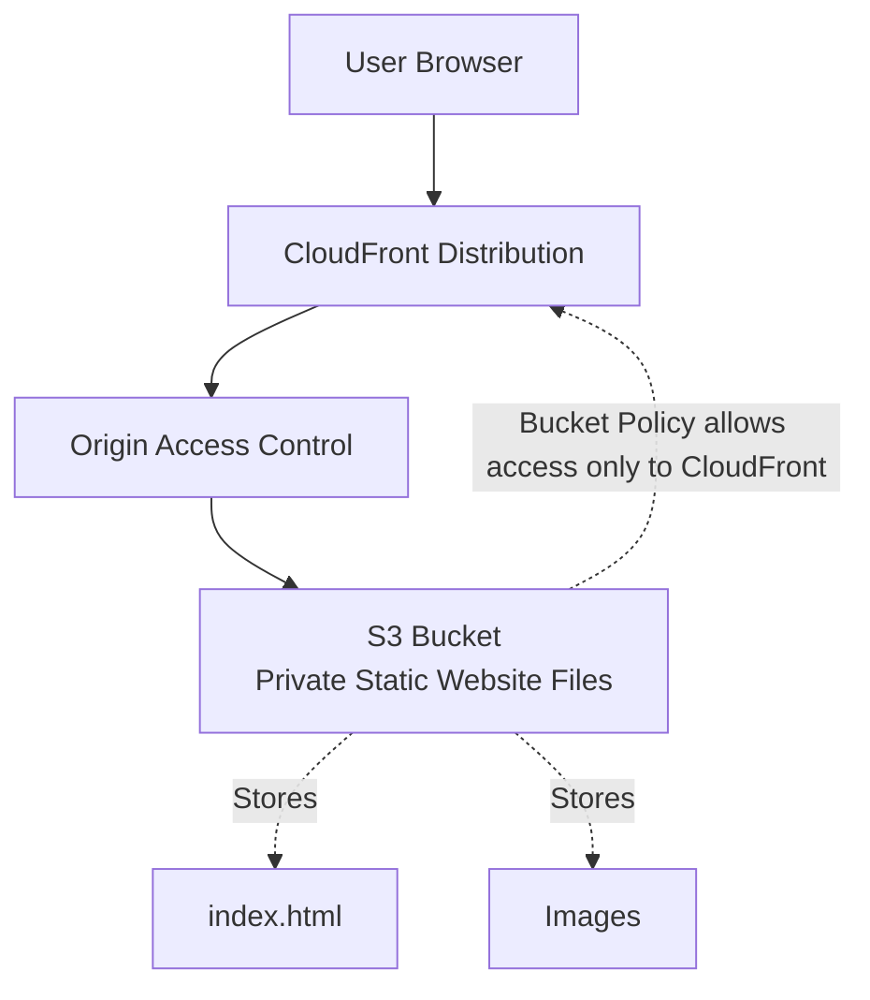
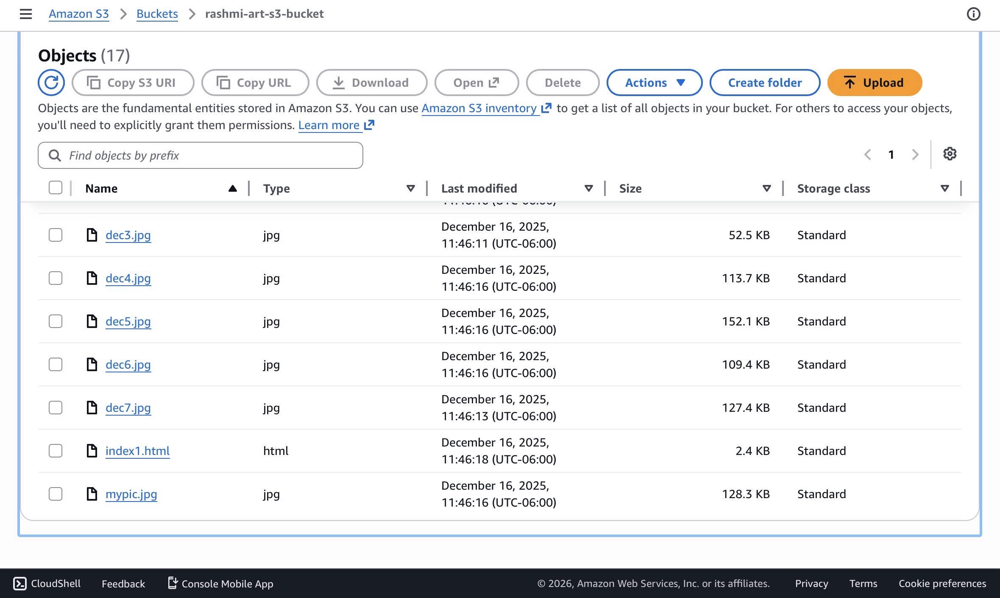
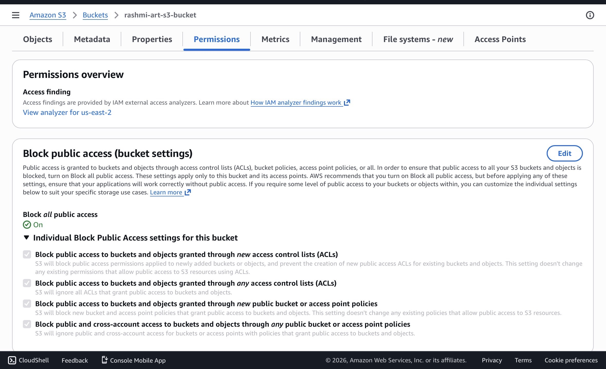
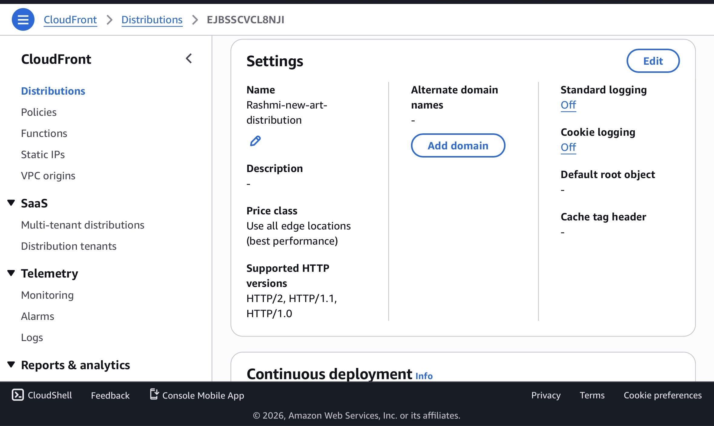
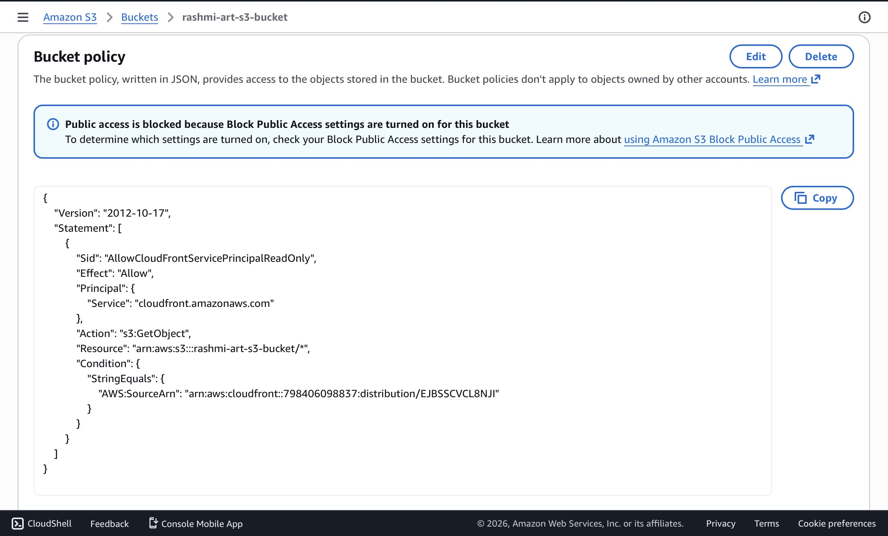
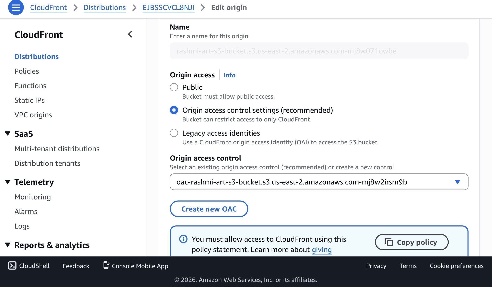
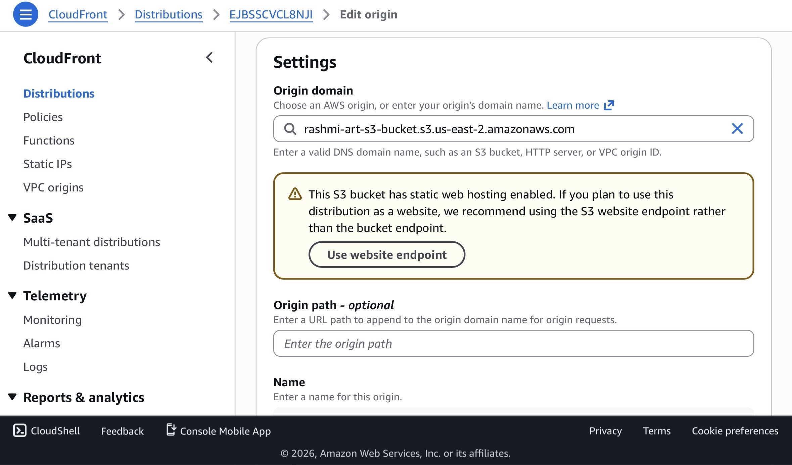

# AWS-Static-Website-Hosting-CloudFront-Private-S3

## Project Overview:   
Built a secure static website hosting solution using Amazon S3 and Amazon CloudFront. The S3 bucket remains private and website content is delivered through CloudFront using Origin Access Control (OAC), ensuring secure and scalable content delivery over HTTPS.

## Architecture:   

## AWS Services Used:   
-Amazon S3.  
-Amazon CloudFront  
-Origin Access Control (OAC)  
-IAM   

## Features:   
-Static website hosting    
-Private S3 bucket  
-HTTPS access  
-Global content delivery through CloudFront   
-Reduced latency through caching  
-Secure access using OAC  

## Implementation Steps:     
**Step 1:** Create S3 Bucket   
Created an S3 bucket.  
Uploaded website files.  
Kept bucket private.  
**Step 2:** Configure CloudFront  
Created CloudFront distribution.  
Selected S3 bucket as origin.  
Enabled OAC.  
**Step 3:** Configure Bucket Policy  
Allowed CloudFront to access bucket objects.  
**Step 4:** Deploy Website    
Waited for CloudFront deployment    
Accessed website through CloudFront URL.  

## Security Best Practices:     
-S3 Block Public Access enabled.  
-No public object permissions.  
-Access restricted through CloudFront OAC.  
-HTTPS enforced.  

## Screenshots:     
### Website Homepage

### Bucket Contents  

### Bucket Permission

### CloudFront Distribution

### Bucket Policy

### Origin Access Control

### CloudFront Origin 

## Project Outcome:   
Successfully deployed a secure and scalable static website using AWS services while preventing direct public access to S3 objects.  

## Skills Demonstrated:   
-AWS S3 
-AWS CloudFront  
-CDN Concepts  
-Origin Access Control (OAC)  
-IAM Policies  
-Static Website Hosting  
-Cloud Security  

## Repository Structure:   
AWS-Static-Website-Hosting-CloudFront-Private-S3/    
├── README.md   
├── cloudfront-configuration.jpg  
└── cloudfront-general.jpg  
└── cloudfront-origin.jpg  
└── index1.html  
└── s3-bucket-permission.jpg  
└── s3-bucket-policy.jpg  
└── s3-contents.jpg  
└── website-homepage.PNG  
